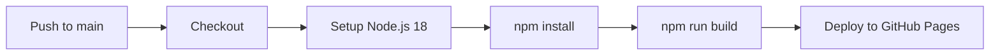

# CC Lab Website

<div align="center">


**Structural Bioinformatics & Molecular Dynamics Laboratory**

*Xian Jiaotong-Liverpool University (XJTLU)*

[Live Site](#) · [Report Bug](https://github.com/colinzyang/cc.lab.xjtlu.github.io/issues) · [Request Feature](https://github.com/colinzyang/cc.lab.xjtlu.github.io/issues)

</div>

---

## About

CC Lab is the official website for the **Structural Bioinformatics & Molecular Dynamics Laboratory** at Xi'an Jiaotong-Liverpool University. The lab combines structural bioinformatics, molecular dynamics simulations, and machine learning methods to investigate protein structure-function relationships and develop computational tools for drug discovery.

This website showcases the lab's research, team members, publications, and news — built with a modern tech stack and deployed automatically to GitHub Pages.

### Key Features

| Feature | Description |
|---------|-------------|
| **Static Hosting** | Deployed on GitHub Pages — fast, reliable, no backend required |
| **Content Management** | Decap CMS integration for non-technical content editing |
| **Responsive Design** | Mobile-first layout with dark mode support |
| **Dynamic Data** | JSON-based content with version control and easy updates |
| **Type-Safe** | Full TypeScript strict mode for robust development |

---

## Tech Stack

| Layer | Technology |
|-------|------------|
| **Framework** | React 18 |
| **Language** | TypeScript 5 |
| **Routing** | React Router v6 (HashRouter) |
| **Styling** | Tailwind CSS v4 |
| **Animation** | Framer Motion |
| **Icons** | Lucide React |
| **Build** | Vite 5 |
| **CMS** | Decap CMS |

---

## Getting Started

### Prerequisites

- **Node.js** v18 or higher
- **npm** or yarn

### Installation

```bash
# Clone the repository
git clone https://github.com/colinzyang/cc.lab.xjtlu.github.io.git
cd cc.lab.xjtlu.github.io

# Install dependencies
npm install

# Start development server
npm run dev
```

Open [http://localhost:5173](http://localhost:5173) in your browser.

### Available Scripts

| Command | Description |
|---------|-------------|
| `npm run dev` | Start development server |
| `npm run build` | Build for production (outputs to `dist/`) |
| `npm run preview` | Preview production build locally |

---

## Project Structure

```
.
├── components/              # Page components (Member, Publication, News, etc.)
├── src/
│   ├── context/             # React Context (breadcrumb state)
│   └── lib/
│       ├── dataLoader.ts    # Data fetching & type definitions
│       └── utils/
│           └── bibtexParser.ts  # BibTeX parsing utilities
├── public/
│   ├── data/                # JSON data files (CMS-managed)
│   │   ├── members.json
│   │   ├── publications.json
│   │   ├── news.json
│   │   └── labInfo.json
│   ├── admin/               # Decap CMS interface
│   └── assets/images/       # Team photos, paper thumbnails, etc.
├── App.tsx                  # Main app with routing
├── index.html               # HTML template
├── vite.config.ts           # Vite configuration
├── tsconfig.json            # TypeScript configuration
└── CLAUDE.md                # Detailed developer guidelines
```

---

## Routing

The site uses **hash-based routing** for GitHub Pages compatibility.

| Route | Page |
|-------|------|
| `/` | Home (Hero + Recent Posts) |
| `/#/member` | Team Members |
| `/#/publication` | Research Publications |
| `/#/news` | News & Events |
| `/#/resources` | Resources |
| `/#/contact` | Contact Information |

---

## Content Management

### Decap CMS

Access the CMS to manage content without touching code:

- **Development:** `http://localhost:5173/admin/`
- **Production:** `https://your-domain.com/admin/`

### Editable Collections

| Collection | Description |
|------------|-------------|
| **Members** | Lab members (PI, current members, alumni) |
| **Publications** | Research papers organized by year |
| **News** | News and event announcements |
| **Lab Info** | Lab description and contact information |

### BibTeX Import

The CMS includes a custom BibTeX widget for batch importing publications with:
- Automatic author name format conversion
- DOI-based link generation
- Preprint detection (arXiv, bioRxiv, ChemRxiv)
- Duplicate detection

### Manual Editing

Edit JSON files directly in `public/data/`. Hard-refresh the browser (Cmd+Shift+R) to see changes during development.

---

## Deployment

The site is automatically deployed to GitHub Pages via GitHub Actions when pushing to the `main` branch.

### Workflow



No manual deployment required — just commit and push!

---

## Image Management

### Directories

| Directory | Purpose | Recommended Size |
|-----------|---------|------------------|
| `public/assets/images/people/` | Team photos | 400×400px |
| `public/assets/images/papers/` | Publication thumbnails | 500×300px |
| `public/assets/images/posts/` | News/blog images | 800×600px+ |

### Naming Conventions

- **People:** `bio-lastname.jpg` (e.g., `bio-chan.jpg`)
- **Papers:** `paperX.jpg` (e.g., `paper1.jpg`)
- **Posts:** `descriptive-name.jpg`

### Optimization

- Format: JPG at 85% quality
- File size: Under 500KB

---

## Browser Support

| Browser | Support |
|---------|---------|
| Chrome  | Latest  |
| Firefox | Latest  |
| Safari  | Latest  |
| Edge    | Latest  |

Built with CSS Grid, Flexbox, and mobile-first responsive design (breakpoints: 768px, 1024px).

---

## Development Notes

- **TypeScript Strict Mode** — Full type checking enabled; build fails on errors
- **Tailwind CSS v4** — Theme customization via `@theme` directive in `src/index.css`
- **Dark Mode** — Class-based toggling with `dark:` prefix
- **Data Caching** — DataLoader caches fetched data; hard-refresh to see JSON changes

For detailed guidelines, see [CLAUDE.md](./CLAUDE.md).

---

## License

This project is provided as-is for the CC Lab at XJTLU.

---

<div align="center">

**CC Lab @ XJTLU** · School of Science · Center for Intelligent RNA Therapeutics

</div>
